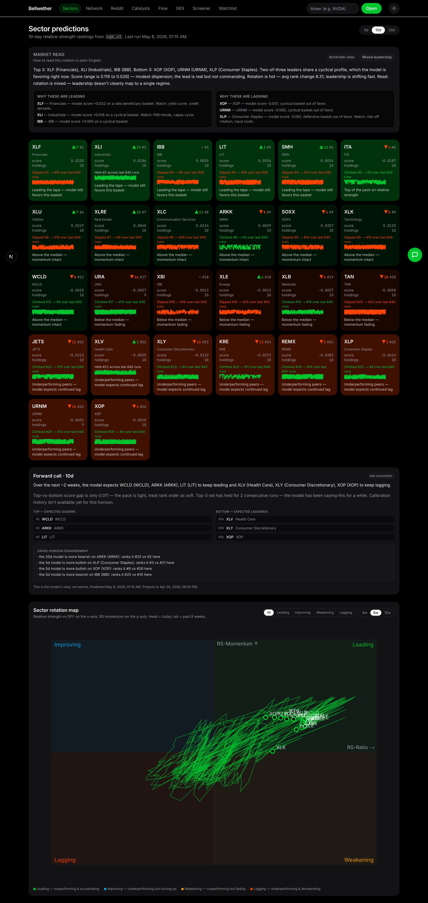
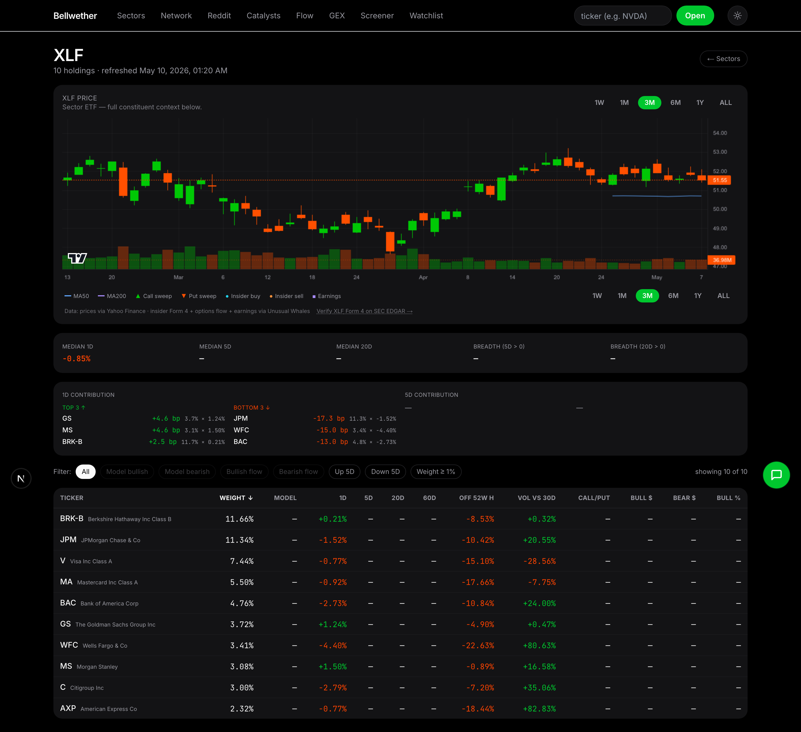
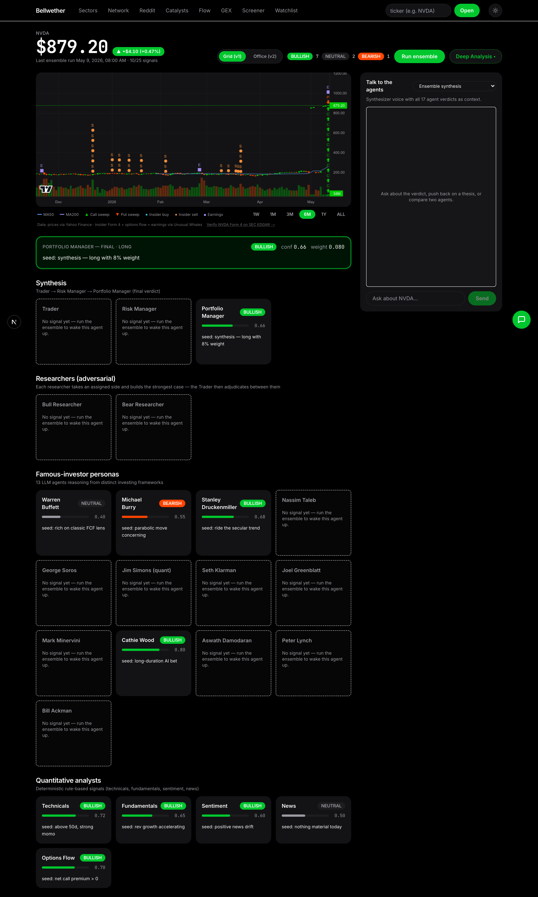
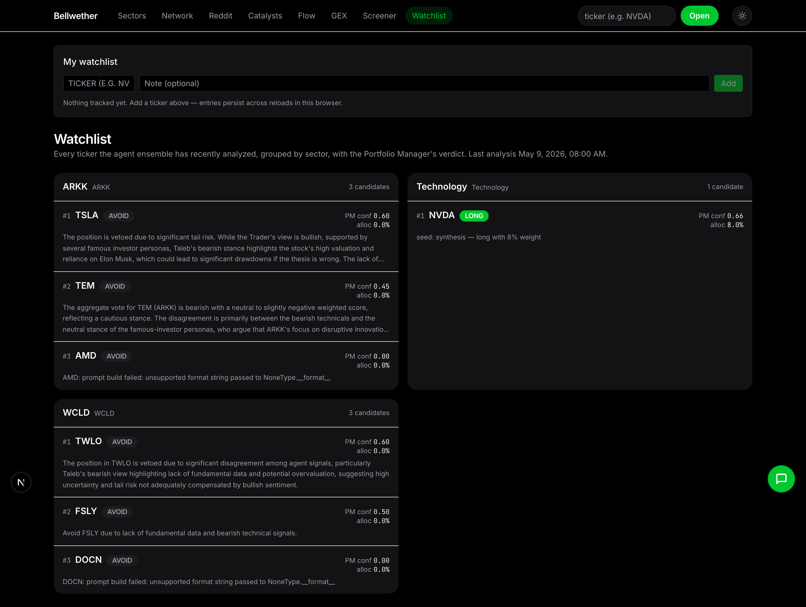
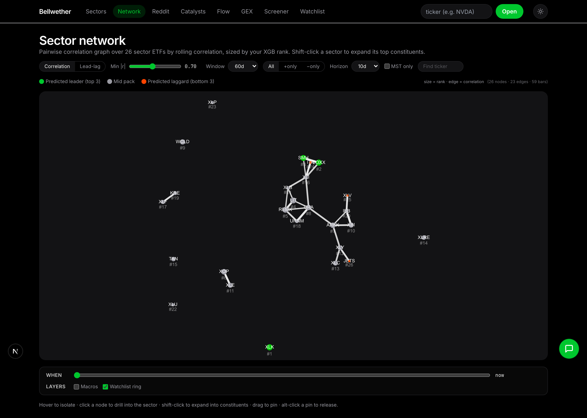
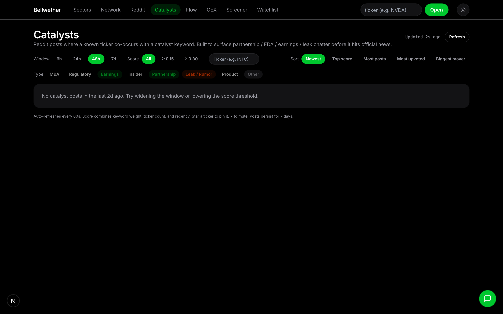
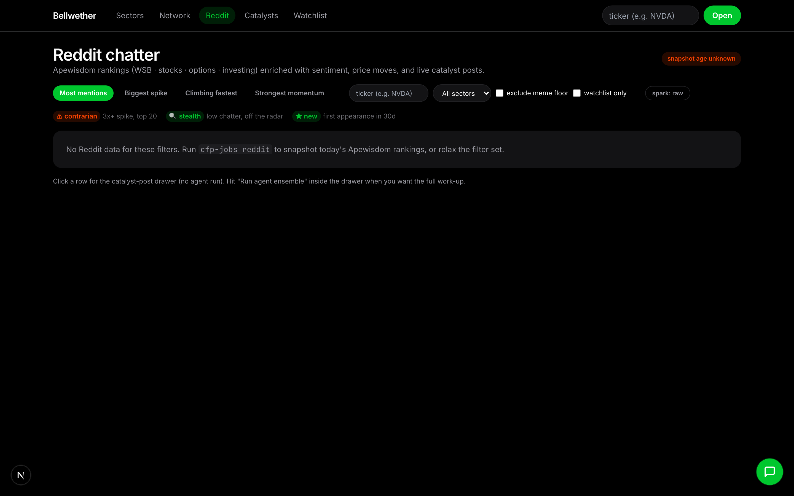
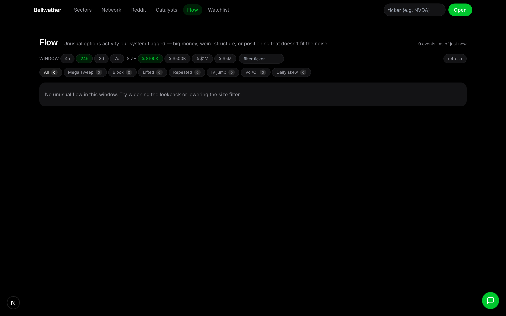
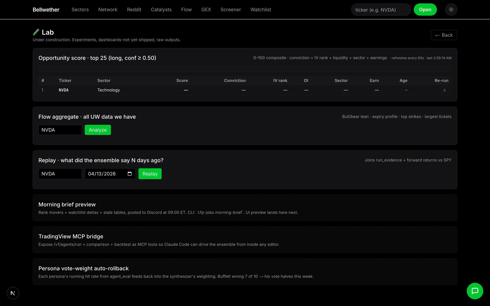

# Bellwether

Who's leading, who's lagging, and why.

Bellwether is a sector-rotation forecasting stack with a 25-agent investor
ensemble layered on top. The XGBoost predictor ranks 26 sector & thematic
ETFs by expected forward relative strength; the agent ensemble (5 quant
analysts + 13 named investor personas + adversarial researchers + trader +
risk manager + portfolio manager) turns that signal into a per-ticker
verdict you can actually act on, with rationale in plain English.

Full design and roadmap: [docs/DESIGN.md](docs/DESIGN.md).



---

## What's in the app

The web app is a Next.js 15 dashboard with six top-level tabs plus a
drill-in Agents view, each backed by its own FastAPI route and (where
applicable) a background ingestion job. A page-aware assistant dock is
mounted on every page.

### Sectors — XGB rotation board

The home page ranks all 26 sector & thematic ETFs by the latest XGB
prediction, color-coded by theme (secular growth, cyclical, defensive,
rate-sensitive, …) and annotated with rank deltas, sparklines, and a
**plain-English market read** explaining *why* the ranking looks the way
it does — including a **forward-call narrative card** and **1D / 5D top
contributors and detractors** per sector. The ranker exposes a scorecard
(IC vs. naive baseline) so you can see how the model is doing out of
sample; recent rotation features include macro-sensitivity exposures and
constituent breadth.

Click any tile to drill into the sector's constituents:



Sortable on weight, model score, 1d / 5d / 20d / 60d returns, and percent
off the 52-week high. Inline price chart at the top.

### Agents — the 25-agent ensemble

Click any ticker to run (or fetch the cached run of) the full ensemble:



Five rule-based analysts feed thirteen LLM-driven investor personas
(Buffett, Burry, Druckenmiller, Taleb, Soros, Simons, Klarman, Greenblatt,
Minervini, Cathie Wood, Damodaran, Lynch, Ackman). Each persona writes a
5-step persona-shaped chain of thought and emits a tri-state signal with
confidence and rationale. The top bull and top bear are then forced into a
structured cross-examination (target claim → flip condition → rebuttal →
confidence after). A bull researcher and bear researcher each write the
strongest case for their side; a Trader reconciles them; a Risk Manager
sizes the position; a Portfolio Manager makes the final long / short /
avoid call.

Beyond the rule-based analysts, the personas receive **structured
evidence** drawn from Unusual Whales (flow, dark pool, **insider
asymmetry** — buy-vs-sell value tilt with cluster detection, ETF
holdings), the **skylit.ai / Heatseeker structural snapshot + 0DTE
Trinity** signals, the Reddit catalyst feed (**post bodies included**,
not just titles — the sentiment analyst now counts catalyst-feed posts
toward Reddit evidence and emits a **news sentiment rollup** with the
top three headlines per ticker), and the latest XGB rotation rank for
the underlying sector.

You can talk to the synthesizer or any individual persona in their voice
via SSE-streamed chat at the bottom of the page.

### Watchlist — final PM verdicts by sector



Top constituents per top-ranked sector with the Portfolio Manager's
verdict, confidence, allocation %, and expandable reasoning chain. Built by
the `cfp-jobs build-watchlist` job.

### Network — correlation + lead-lag



Force-directed graph over the 26 sector ETFs with two modes:

- **Correlation** — pairwise Pearson r over a rolling window (60d default),
  with an optional MST overlay to surface the backbone of the market.
- **Lead-lag** — directed Granger-causality DAG showing which sectors lead
  which on a chosen horizon. Surfaces *"leader moved → watch follower"*
  triggers.

Plus: a **time slider** to scrub correlation history, a **macro overlay**
projecting macro series (DGS10, VIX, DXY, …) onto the graph, a
**watchlist ring** highlighting sectors with active PM verdicts, and a
**shock mode** that re-runs the graph under a chosen stress (rates up,
VIX up, oil up). Hover to isolate a node, click to drill into the
sector, shift-click to expand its top constituents (with their pairwise
correlations), drag to pin.

### Catalysts — Reddit posts that matter



Catalyst-keyword feed pulled from r/stocks, r/investing, r/wallstreetbets,
and r/options. Posts are classified (partnership / FDA / earnings beat /
insider / acquisition / …), aggregated by ticker, clustered by composite
score, and persisted. Filter by hour window (6h–7d), confidence threshold,
sort by newest / top score / cluster size / engagement / biggest mover.

A **30-day per-category track record** panel sits above the feed: hit
rate and average forward return per catalyst type over the trailing 30
days, so you can tell at a glance which categories are paying off and
which are noise.

### Reddit chatter — Apewisdom + enrichment + ML predictor



Top-mentioned tickers from the latest Apewisdom snapshot, enriched with:

- sentiment bull share (from catalyst-keyword posts, last 7d)
- price change 1d / 5d
- momentum score (slope of last-7d mention count)
- audience skew (WSB vs. r/investing)
- catalyst post count + freshness tone
- sparkline + per-subreddit breakdown
- contrarian + stealth-setup flags
- **composite 20d score** + rule-based bull/bear signals with
  backtested win rates
- **xgb_reddit_v1** — an ML predictor over the enrichment features.
  Per-ticker prediction + scorecard (precision @ top-K, lift vs.
  baseline) backfilled nightly against realized 5d returns, with a
  `subreddit_edge` feature pulled from per-sub historical IC.

A drawer opens the underlying Reddit thread; a backtest tab aggregates
"do mention spikes lead price moves?" by spike-bucket.

> **Heads-up:** the Reddit tab depends on migrations `0009_reddit_mentions.sql`
> + `0010_reddit_posts.sql` (and `0011_reddit_predictions.sql` +
> `0013_reddit_outcomes.sql` for the ML scorecard) plus the `apewisdom`
> and `reddit_rss` ingestion jobs. If you see "failed to fetch", run
> `make migrate` then `make daily`.

### Flow — unusual options activity



Anomaly feed over the Unusual Whales options trade stream, classified
into seven anomaly kinds: **mega sweep** (big $ swept across exchanges),
**block** (floor block, often LEAPs), **ask aggression** (≥85% of premium
lifted), **repeated hits** on a single chain, **IV expansion** during the
alert, **vol/OI explosion** (brand-new positioning), and **daily skew**
(net call vs. put premium lopsided beyond 4×). Filter by anomaly kind
and minimum premium ($100K – $5M) — the window dropdown was dropped so
the panel analyzes every alert we've ingested.

Behind it sits `/v1/stocks/screen`, a server-side ranker that scores
tickers as options-trade candidates by combining flow conviction (from
the `whale_conviction` table, migration `0014`) with the XGB sector
signal and momentum/volatility features.

**Per-ticker flow aggregate.** Punch in any symbol and the panel rolls
up every alert we've ingested for it (default lookback 730d):
call-premium share, ask aggression %, sweep %, premium concentration in
the top expiry, **expiry-bucket breakdown** (0–7d / 8–30d / 31–90d /
90d+), and **OI growth by strike** so you can see where new positioning
is actually being built versus where it's just churn. A verdict header
classifies the print as bullish flow / bearish flow / mixed with a
plain-English reason.

**Suggested Plays — PROCEED / WAIT / SKIP.** On top of the aggregate,
`/v1/flow/suggest-plays/{ticker}` emits a decisive gate plus a ranked
list of specific contracts (strike, expiry, side, rationale). Falls
through to flow-only candidates when the OI snapshot lags ingest so the
panel never goes blank just because the nightly snapshot hasn't caught
up.

Backfill is run manually via `cfp-jobs flow-backfill <TICKER>` (uses a
paginated UW client to walk historical alerts).

### Lab — opportunity score, calibration, ensemble freshness



A secret `/lab` tab (not in the top nav, link is in the dock) collects
the tooling we use to keep the ensemble honest:

- **Opportunity score (0–100)** per ticker — `/v1/stocks/{T}/opportunity`
  combines XGB sector edge, flow conviction, persona consensus, and
  catalyst freshness into one number.
- **Calibration line** — predicted opportunity score vs. realized 5d
  forward return, bucketed, so you can eyeball whether the score is
  paying off.
- **Screener freshness panel** — last-run timestamp + the catalyst
  rerun queue (`cfp-jobs rerun-stale` triggers an ensemble refresh on
  any ticker that picked up a fresh, high-confidence Reddit catalyst).
- **Replay** — `/v1/agents/{T}/replay` returns the exact persona
  signals + debate transcript from any prior run for diffing.

The **morning brief** (`cfp-jobs morning-brief`) is the cron-fed
narrative version of all of the above: today's top opportunity scores,
fresh catalysts, flow standouts, and any GEX regime shifts, dropped
into the daily refresh log so you have one page to skim at the open.

### GEX — morning brief + intraday level alerts (SPY / QQQ / SPXW)

The GEX tab surfaces structural reads from the **skylit.ai / Heatseeker
0DTE GEX data** for the index trio. The morning brief auto-fires at
**09:31 ET** on NYSE trading days with king nodes, pika floors and
ceilings, barney walls, regime score, bias, and active patterns per
ticker. Intraday checkpoints (10:00, 10:30, …, 15:55 ET) emit a card
**only when something material changed since the last baseline** —
regime crossing ±0.30, king sign flip, spot breaking a baseline floor or
ceiling, trinity alignment shift, or a new pattern detected. Filter by
source (Brief / Monitor / Scanner) or by ticker.

A live skylit auth status badge (green / yellow / red) sits at the top
of the page along with a **Re-auth skylit** button — clicking it queues
a job for the local `cfp-jobs skylit-watch` daemon, which opens a
Chromium window for Discord OAuth and writes the captured Clerk cookie
back into Postgres so the next deploy survives without manual re-auth.
With the in-process rotation persistence fix, you only need to re-auth
when Clerk genuinely expires the underlying session (roughly once a
quarter, not every other day).

The poller, scheduler, brief, and monitor all live in `apps/gex/` and
deploy as a second Railway service alongside the API, reading cookies
from Postgres (`skylit_credentials`) on boot. See
[apps/gex/railway.toml](apps/gex/railway.toml) for service setup notes
and the bootstrap CLI (`cfp-jobs skylit-bootstrap`) for the one-time
migration of cookies from a local `.env`.

### Top-level assistant

A floating chat dock is mounted on every page. SSE-streamed Moonshot
tool-calling loop with six tools (`get_rankings`, `get_sectors_heatmap`,
`get_agents_for_ticker`, `get_catalysts`, `run_ensemble`, `navigate`) so
you can ask "what's flagged in tech today?" or "run the ensemble on
RKLB" from anywhere. The dock is **page-aware**: it pre-loads the
current route's context (active sector, ticker, filters) so questions
like "explain this ranking" or "why is this one flagged?" resolve
against what you're looking at.

---

## Architecture

```
apps/
  api/        # FastAPI inference + chat service (Railway)
  jobs/       # Ingestion, training, ensemble runner, watchlist builder, skylit-watch daemon
  web/        # Next.js 15 + React 19 + Tailwind + lightweight-charts (Vercel)
  gex/        # Node.js Heatseeker SSE poller + 09:31 ET scheduler + intraday monitor (Railway, separate service)
packages/
  shared/     # Pydantic schemas
  features/   # Feature engineering (Alpha158, Granger, sector flows)
  models/     # XGBoost training + inference
  agents/     # 25-agent ensemble (LangGraph state machine)
  skills/     # Claude skill bundles
infra/
  migrations/ # SQL migrations (0001..0017)
  railway.toml      # API service config
                    # Note: apps/gex has its own railway.toml — second service in the same project
docs/
  DESIGN.md
  screenshots/
```

**Data layer:** Postgres + TimescaleDB (`prices_daily`, `macro_daily`,
`features_daily`, `predictions`, `lead_lag_matrix`, `sector_holdings`,
`fundamentals`, `agent_signals`, `watchlists`, `uw_*` for Unusual
Whales, `uw_etf_holdings`, `reddit_mentions`, `reddit_posts`,
`reddit_predictions`, `reddit_outcomes`, `etf_breadth_snapshots`,
`whale_conviction`, `run_evidence`, `agent_eval`, `stock_universe`).

**Agent ensemble:** LangGraph DAG —
`analysts → personas → debate → researchers → trader → risk_manager → portfolio_manager`.
Provider-agnostic (Anthropic or Moonshot), with Langfuse cost tracking.

---

## Local dev

### Prereqs

- [uv](https://docs.astral.sh/uv/) — Python toolchain
- [pnpm](https://pnpm.io/) 9.x — JS workspaces
- Docker — local Postgres + TimescaleDB

### Bring it up

```bash
# 1. Postgres + TimescaleDB (auto-applies infra/migrations/*.sql on first run)
make up

# 2. Install Python workspace
uv sync --all-packages --all-extras

# 3. Install JS workspace
pnpm install

# 4. Apply any new migrations against an existing DB (idempotent)
make migrate

# 5. Run the API
cp .env.example .env
make dev   # http://localhost:8000

# 6. Run the web app (in a second terminal)
cd apps/web && pnpm dev   # http://localhost:3000

# 7. Smoke tests
curl http://localhost:8000/health        # {"status":"ok"}
curl http://localhost:8000/healthz/db    # {"status":"ok"} when DB is up
```

### Data ingestion

```bash
make backfill   # 5y yfinance OHLCV (~50 symbols) + FRED macro (~8 series)
make daily      # 7-day incremental, idempotent — schedule on cron
make status     # row counts + freshness per table
```

Requires `FRED_API_KEY` in `.env`. yfinance is unauthenticated. Optional
data sources (set in `.env` to enable):

- `FMP_API_KEY` — fundamentals + ETF holdings
- `UNUSUAL_WHALES_API_KEY` — options flow, dark pool, insider
- `LANGFUSE_*` — prompt + cost tracing
- `MOONSHOT_API_KEY` or `ANTHROPIC_API_KEY` — agent ensemble

### Running the ensemble for a ticker

```bash
uv run --package cfp-jobs cfp-jobs run-agents NVDA
uv run --package cfp-jobs cfp-jobs build-watchlist
```

### Skylit (Heatseeker) login refresh

skylit.ai sits behind Clerk + Discord OAuth. Discord blocks programmatic
login (captcha + ToS), so a human consent click in a real Chromium
window is unavoidable. With the gex service deployed on Railway,
cookies now live in Postgres (`skylit_credentials`); the laptop's only
role is to capture fresh cookies when needed, which the
**rotation-persistence fix** makes a roughly quarterly event rather
than daily.

Two workflows depending on whether you're seeding for the first time or
refreshing later:

**One-time bootstrap** — if you already have valid CLERK_* values in a
local `.env` (e.g. you ran the standalone gexester-vexster before),
seed Postgres without re-doing OAuth:

```bash
BELLWETHER_API_URL=https://capital-flow-predictor-production.up.railway.app \
BELLWETHER_API_KEY=<your key> \
uv run cfp-jobs skylit-bootstrap
```

**Ongoing re-auth** — leave this daemon running on your laptop; it
long-polls Bellwether for re-auth requests, opens Chromium for Discord
OAuth on demand (click the **Re-auth skylit** button in the GEX tab),
and writes the captured cookies back to Postgres automatically.

```bash
uv run playwright install chromium
caffeinate -i env \
  BELLWETHER_API_URL=https://capital-flow-predictor-production.up.railway.app \
  BELLWETHER_API_KEY=<your key> \
  uv run cfp-jobs skylit-watch
```

`cfp-jobs skylit-login` (the original one-shot CLI that writes to `.env`)
still works for fully-local dev where Postgres isn't in play.

### Capturing fresh README screenshots

```bash
# With API on :8000 and web on :3000
uv run python scripts/capture_screenshots.py
```

Writes 9 PNGs into `docs/screenshots/`.

---

## Tests + CI

```bash
make test
```

CI runs the same commands plus a Postgres service container — see
[.github/workflows/ci.yml](.github/workflows/ci.yml).

---

## Daily refresh

```cron
30 22 * * 1-5  cd /path/to/repo && /usr/bin/make daily >> /tmp/cfp-daily.log 2>&1
```

(5:30pm ET on weekdays = 22:30 UTC.)

---

## Deploy

API: Railway, Dockerfile-based — [infra/railway.toml](infra/railway.toml).
Web: Vercel — [apps/web/vercel.json](apps/web/vercel.json).

**Required env vars** (full list with sensible defaults: [.env.example](.env.example)):

| Env | Where | Value |
|-----|-------|-------|
| `DATABASE_URL` | Railway | Auto-injected by Postgres add-on |
| `API_KEYS_RAW` | Railway | `openssl rand -hex 32` — leave empty to disable auth (dev only) |
| `CORS_ORIGINS_RAW` | Railway | `https://<your-vercel-domain>` |
| `ANTHROPIC_API_KEY` | Railway | Required for the **Deep Analysis** Claude path |
| `MOONSHOT_API_KEY` | Railway | Default LLM for the ensemble |
| `UNUSUAL_WHALES_API_KEY` | Railway | Required for flow/dark-pool/insider context |
| `FRED_API_KEY`, `FMP_API_KEY` | Railway | Required for macro + fundamentals |
| `NEXT_PUBLIC_API_BASE_URL` | Vercel | `https://<your-railway-domain>` |
| `NEXT_PUBLIC_API_KEY` | Vercel | **Same value** as one of the `API_KEYS_RAW` entries |

Migrations are auto-applied at boot via the FastAPI lifespan hook
(`apps/api/src/cfp_api/migrations.py`) — no manual `make migrate` step needed
unless you're seeding into a brand-new DB.

**Post-deploy verification:**

```bash
API_BASE=https://<your-api> API_KEY=<your-key> ./scripts/smoke_test.sh
```

Should print `8 passed, 0 failed`. The same script runs on every push to `main`
via [.github/workflows/smoke.yml](.github/workflows/smoke.yml). See
[docs/RUNBOOK_VERIFY.md](docs/RUNBOOK_VERIFY.md) for deeper checks.

**Endpoints documented in [docs/API.md](docs/API.md)** (regenerate via
`python scripts/export_openapi.py` after route changes).

---

## License

Private.
