# Bellwether

Who's leading, who's lagging, and why.

Bellwether is a sector-rotation forecasting stack with a 25-agent investor
ensemble layered on top. The XGBoost predictor ranks 26 sector & thematic
ETFs by expected forward relative strength; the agent ensemble (5 quant
analysts + 13 named investor personas + adversarial researchers + trader +
risk manager + portfolio manager) turns that signal into a per-ticker
verdict you can actually act on, with rationale in plain English.

Full design and roadmap: [docs/DESIGN.md](docs/DESIGN.md).


---

## What's in the app

The web app is a Next.js 15 dashboard with eight top-level tabs plus a
secret Lab tab and a drill-in Agents view. Each tab is backed by its own
FastAPI route and (where applicable) a background ingestion job. A
page-aware assistant dock is mounted on every page.

Top nav, in order:
**Sectors · Reddit + Catalysts · Flow · GEX · Explosive · Screener · Scanner · Discord Alerts**.

### Sectors — heatmap, cohorts, network (one tab)

The home page now consolidates three views behind a pill toggle:

- **Heatmap** — all 26 sector & thematic ETFs ranked by trailing return,
  color-coded by theme (secular growth, cyclical, defensive,
  rate-sensitive, …) and annotated with rank deltas, sparklines, and a
  **plain-English market read** explaining *why* the ranking looks the
  way it does, plus a **forward-call narrative card** and **1D / 5D top
  contributors and detractors** per sector.
- **Cohorts** — sub-industry pair-spread z-scores with Engle-Granger
  cointegration flags and earnings-window annotations. Stacks alongside
  a laggards-vs-sector-median panel on each sector drill-down.
- **Network** — force-directed graph over the 26 sector ETFs in two
  modes: **Correlation** (pairwise Pearson r over a rolling window, MST
  overlay) and **Lead-lag** (Granger-causality DAG). Plus time slider
  for correlation history, macro overlay (DGS10, VIX, DXY, …),
  watchlist ring, and shock mode (rates / VIX / oil stress).

Click any tile to drill into the sector's constituents:


Sortable on weight, 1d / 5d / 20d / 60d returns, and percent off the
52-week high. Inline price chart at the top, laggards-vs-median panel
beneath.

### Agents — the 25-agent ensemble

Click any ticker (from any tab) to run (or fetch the cached run of) the
full ensemble:


Five rule-based analysts feed thirteen LLM-driven investor personas
(Buffett, Burry, Druckenmiller, Taleb, Soros, Simons, Klarman, Greenblatt,
Minervini, Cathie Wood, Damodaran, Lynch, Ackman). Each persona writes a
5-step persona-shaped chain of thought and emits a tri-state signal with
confidence and rationale. The top bull and top bear are then forced into a
structured cross-examination (target claim → flip condition → rebuttal →
confidence after). A bull researcher and bear researcher each write the
strongest case for their side; a Trader reconciles them; a Risk Manager
sizes the position; a Portfolio Manager makes the final long / short /
avoid call.

Beyond the rule-based analysts, the personas receive **structured
evidence** drawn from Unusual Whales (flow, dark pool, **insider
asymmetry** — buy-vs-sell value tilt with cluster detection, ETF
holdings, catalysts, spot-GEX 1m, institutional flow), the **skylit.ai
/ Heatseeker structural snapshot + 0DTE Trinity** signals, the Reddit
catalyst feed (**post bodies included**, not just titles), a **news
sentiment rollup** with the top three headlines per ticker from the
6-source news aggregator, and the latest sector rotation context.

You can talk to the synthesizer or any individual persona in their voice
via SSE-streamed chat at the bottom of the page.

### Reddit + Catalysts — chatter board (one tab)

The old Reddit and Catalysts tabs are now stacked into a single
**chatter board**:

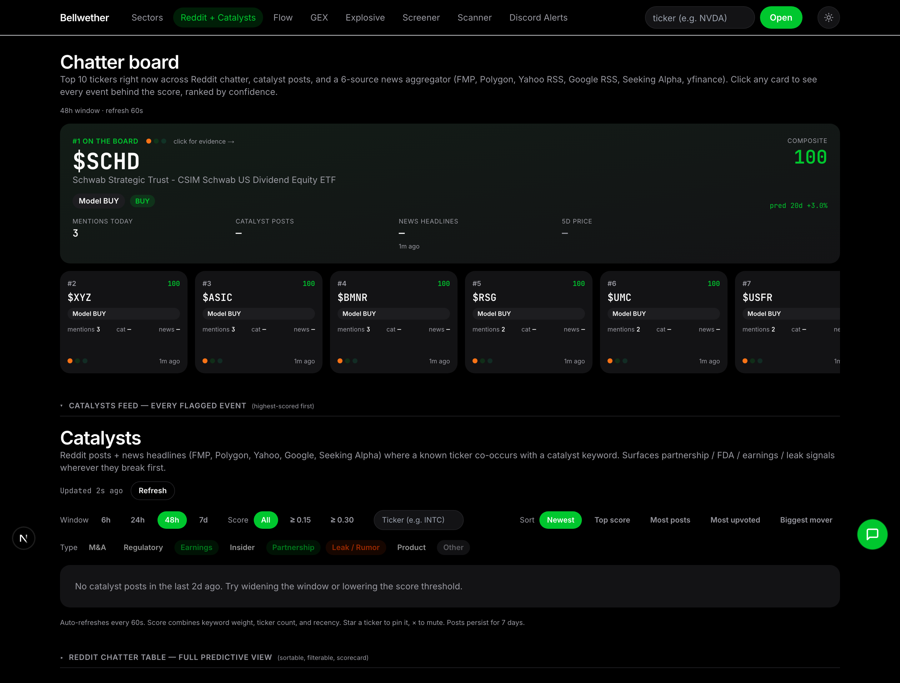

- **Chatter leaderboard** — the headline view. Top tickers across the
  last 48h ranked by a composite of Reddit mention velocity, catalyst
  posts, news hits, and price drift. Each row carries a one-line
  *why-it's-here* tag, source-mix bar (Reddit / Catalyst / News), a
  7-day mention sparkline, a tri-state predictor verdict (buy / fade /
  watch / neutral), and click-through to a **per-ticker evidence
  drawer** with the underlying posts, news items, and price reaction.
- **Catalysts feed** — collapsible section underneath. Every flagged
  catalyst event (partnership / FDA / earnings beat / insider /
  acquisition / …) from r/stocks, r/investing, r/wallstreetbets,
  r/options, plus the 6-source news aggregator. Sortable, filterable,
  with a 30-day per-category track record (hit rate + avg forward
  return per type).
- **Reddit chatter table** — collapsible section for the full
  predictive view: Apewisdom enrichment per ticker (sentiment bull
  share, mention momentum, audience skew, contrarian + stealth-setup
  flags) plus the `xgb_reddit_v1` ML predictor with scorecard
  (precision @ top-K, lift vs. baseline) and per-subreddit edge.

> **Heads-up:** depends on migrations `0009_reddit_mentions.sql`,
> `0010_reddit_posts.sql`, `0011_reddit_predictions.sql`,
> `0013_reddit_outcomes.sql`, and `0028–0030` (catalysts + news) plus
> the `apewisdom`, `reddit_rss`, and `news_aggregator` ingestion jobs.
> If you see "failed to fetch", run `make migrate` then `make daily`.

### Flow — unusual options activity


Anomaly feed over the Unusual Whales options trade stream, classified
into seven anomaly kinds: **mega sweep** (big $ swept across exchanges),
**block** (floor block, often LEAPs), **ask aggression** (≥85% of premium
lifted), **repeated hits** on a single chain, **IV expansion** during the
alert, **vol/OI explosion** (brand-new positioning), and **daily skew**
(net call vs. put premium lopsided beyond 4×). Filter by anomaly kind
and minimum premium ($100K – $5M) — the window dropdown was dropped so
the panel analyzes every alert we've ingested.

Behind it sits `/v1/stocks/screen`, a server-side ranker that scores
tickers as options-trade candidates by combining flow conviction (from
the `whale_conviction` table, migration `0014`) with the XGB sector
signal and momentum/volatility features.

**Per-ticker flow aggregate (Dossier).** Punch in any symbol — or
click any row on the Pulse tape — and a **dossier slide-over** rolls up
every alert we've ingested for it (default lookback 730d):
call-premium share, ask aggression %, sweep %, premium concentration in
the top expiry, **expiry-bucket breakdown** (0–7d / 8–30d / 31–90d /
90d+), and **OI growth by strike** so you can see where new positioning
is actually being built versus where it's just churn. A verdict header
classifies the print as bullish flow / bearish flow / mixed with a
plain-English reason. Five **advanced-signal chips** sit on top: IV
rank, max-pain pull, earnings proximity, skew flip, and NOPE.

**Pulse tape with confluence clustering.** The main tape clusters
related alerts on the same ticker into a single row and ranks the tape
by **confluence score** (alerts that other signals — flow, news,
catalysts, GEX — agree with float to the top). The clustering also
collapses noise so you see one row per setup instead of ten near-dupes.

**Suggested Plays — PROCEED / WAIT / SKIP.** On top of the aggregate,
`/v1/flow/suggest-plays/{ticker}` emits a decisive gate plus a ranked
list of specific contracts (strike, expiry, side, rationale). Falls
through to flow-only candidates when the OI snapshot lags ingest so the
panel never goes blank just because the nightly snapshot hasn't caught
up.

Backfill is run manually via `cfp-jobs flow-backfill <TICKER>` (uses a
paginated UW client to walk historical alerts).

### Explosive — catalyst-aware unusual-options Board

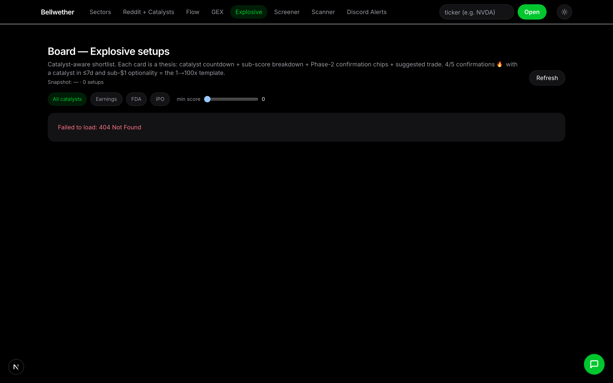

A daily-ish scored shortlist of **catalyst-aware setups** rendered as
thesis cards (not a table). Each card stands alone as a "would I trade
this?" decision: a **catalyst countdown** (earnings / FDA / IPO),
composite score with a sub-score sparkbar (flow concentration · IV term
· squeeze · catalyst · cheap optionality · GEX bonus), Phase-2
confirmation chips (IV-vs-RV, skew flip, NOPE, insider buying, volume
profile), a **suggested trade structure** with a specific top contract,
and click-through to the same dossier slide-over the Flow tape uses.

Filter by catalyst type (earnings / FDA / IPO / all). Pipeline runs
nightly via `cfp-jobs explosive-refresh`; per-ticker drilldowns at
`/explosive/<ticker>` show the underlying sub-score derivation.

### Screener — sector screen + My Watchlist (one tab)


The old Watchlist tab was folded into Screener with a view toggle:

- **Server screen** — `/v1/stocks/screen` ranker. Filter by signal
  direction (long / short / any), confidence floor (50% / 60% / 70%),
  lookback (2w–3m), earnings exclusion window, IV-rank floor, and
  sector. Combines flow conviction (`whale_conviction`), rotation
  context, and momentum / volatility features.
- **My Watchlist** — sidebar of tickers you've pinned manually, with
  the same enrichment cells (sector, last price, model verdict, alloc
  %, expandable reasoning chain). Add or remove from any agent page.

### Scanner — stage scan for S&P 500 (TradingView indicator port)

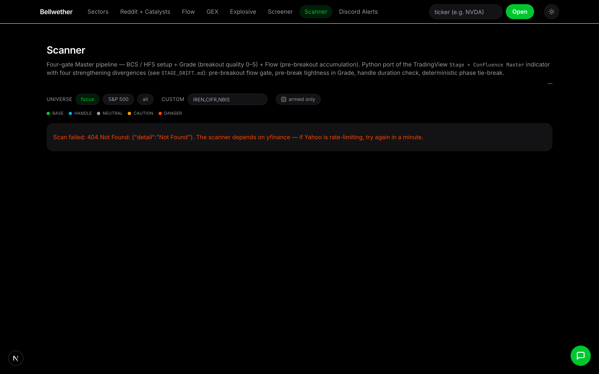

A port of the **Master pipeline** TradingView indicator, scanning all
S&P 500 names every refresh. Each ticker gets a **phase**
(BASE / HANDLE / NEUTRAL / CAUTION / DANGER) with colors matched
cell-for-cell to the indicator's background tints — keep TV open and
compare. 10 stage conditions are broken out as color-coded chips so you
can see exactly which rules pass; a **Grade gate** and **Flow gate**
filter the list. Sortable on Ticker / Phase / Score / Close / Trigger /
Distance / As-of. The repaint fix means rows only flip phase when the
underlying bar closes, never intraday on the same bar.

Per-row drilldown shows the **recommended contracts** + calendar dates
in a targets table. Custom-ticker scans (outside S&P 500) also explain
*why* a scan returned no data when applicable. Reads the vendored S&P
500 list from `infra/seeds/sp500.csv` (Wikipedia 403s pandas now).

### Discord Alerts — third-party server ingestion

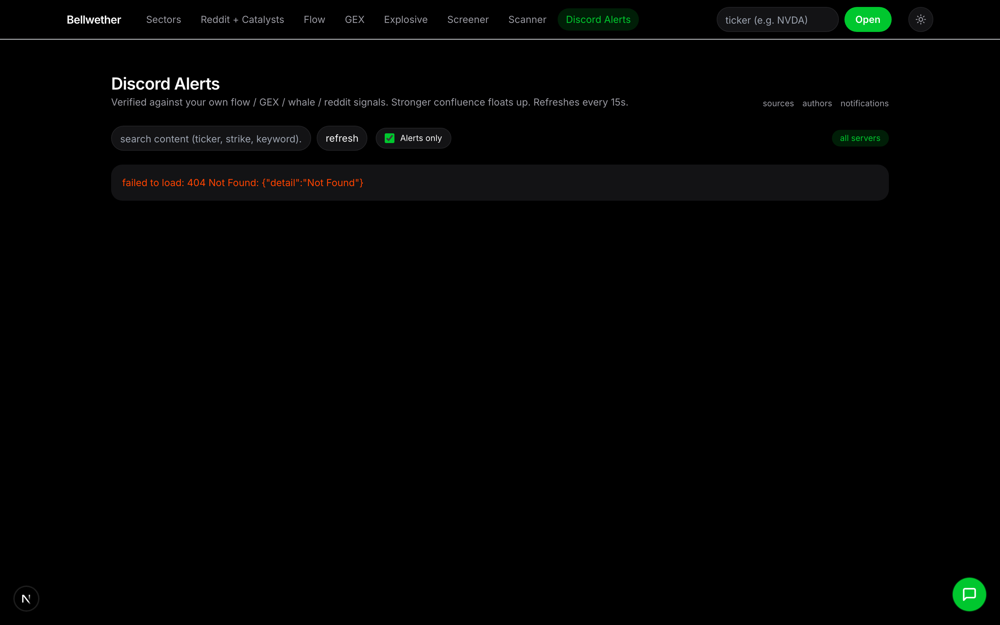

Live feed from the **Discord listener** service. Messages from
allow-listed servers and channels are pulled in, ticker-extracted, and
scored against our own signals (flow, GEX, catalysts) to produce a
**confluence score** — how much our stack agrees with the alert.
Grouped by `server → channel`, sorted by top confluence then recency.
Toggle to hide chat banter (messages with no extracted ticker and no
attachment).

Per-author stats: hit rate, avg confluence on past alerts, and
forward-return tracking on the tickers they've called. The listener
itself lives in [apps/discord_listener/](apps/discord_listener/) and
runs as a separate Railway service.

### Talon — Phase 3-validated flow scanner (504-ticker universe)

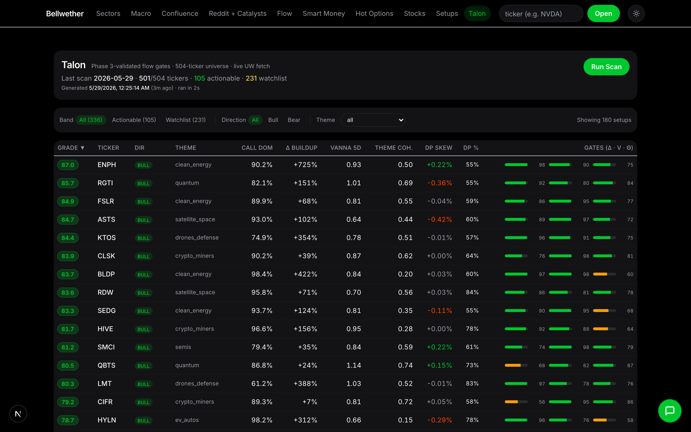

Live UW-driven scanner that ranks **504 tickers** by a composite Grade
built from gates validated against a 48-ticker historical universe
(Phase 3 regression, master R²=0.70 when Grade is layered onto Talon's
own signals). The validated gates: **delta_buildup rank**
(r=+0.49, p=0.0006), **vanna band** (sweet-spot 0.65–1.05, peak 0.85;
the Phase 2 sign was inverted by Phase 3), **theme coherence**
(largest standardized coefficient), and a **call-dominance** anchor.
Excluded after Phase 3: `call_dom_trend_5d` (p=0.49) and `gamma_sign`
(marginal, bullish-only).

Layered on top: a **dark-pool overlay** — DP_VWAP / DP_share / DP_skew
from `stock-volume-price-levels`. **Display-only**, no grade weight yet
(awaiting Phase 5 validation). Used to flag conflicts (bullish thesis
but DP distributing — e.g. BTDR at −1.08% skew), confirmations (ENPH
+0.22%, SMCI +0.22%), and stealth accumulation candidates
(DP_share > 70%, e.g. RDW at 84%, LMT 83%, ABBV 82%).

**Every Run Scan = brand-new UW fetch.** 504 GEX timeseries + 504
volume-by-price calls fanned out at concurrency 5 (UW's 120/min limit).
Cold-cache scan runs in ~7–10 min; concurrent clicks share the
in-flight scan via an internal lock and don't double-fetch. Progress is
exposed at `GET /v1/talon/scan/progress` (phase + ticker counter +
elapsed); the UI polls every 2 s during a scan, every 30 s as a
background heartbeat. Results persist to Postgres (`talon_scans`,
migration 0040) so the latest scan survives Railway redeploys and
concurrent users see the same result.

The full research pipeline that produced these gates is in
[talon_analysis/](talon_analysis/) — Phase 1 (scorecard against the
published May 18 scan, 30 tickers, Grade → 2-week return r=+0.55,
p=0.003), Phase 2 (six per-task deep dives including the ENPH-vs-MSFT
+1369 % vs +28 % delta-buildup gap), Phase 3 (48-ticker universe
regression), Phase 4 (full 504-ticker live scan + DP overlay +
contract-pick analysis).

### Macro — top-down rates / yield-curve / credit context

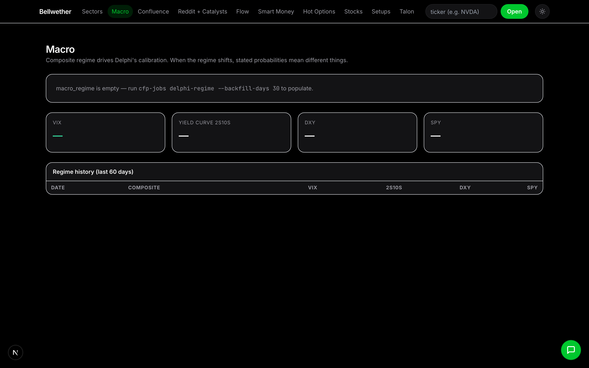

Macro regime tab: yield curve shape, real rates, IG/HY credit spreads,
DXY, and the macro composite our XGBoost predictor uses as a top-down
filter for sector rotation. Use as context when bottom-up signals
disagree across tabs.

### Confluence — cross-tab aggregator

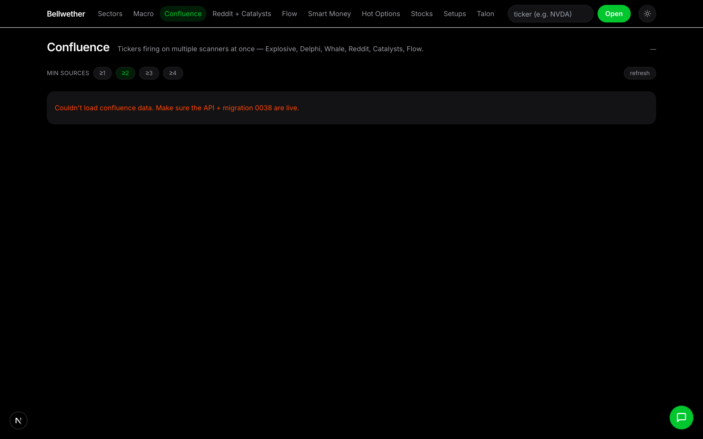

Lazy aggregator that scores every ticker by how many other tabs
agree with the same direction. Pulls from Explosive + Delphi +
Whale + Reddit + Flow. Tickers showing up on ≥3 of those independent
signals jump to the top — the strongest "everyone's seeing the same
thing" filter in the stack.

### Smart Money — institutional positioning rollup

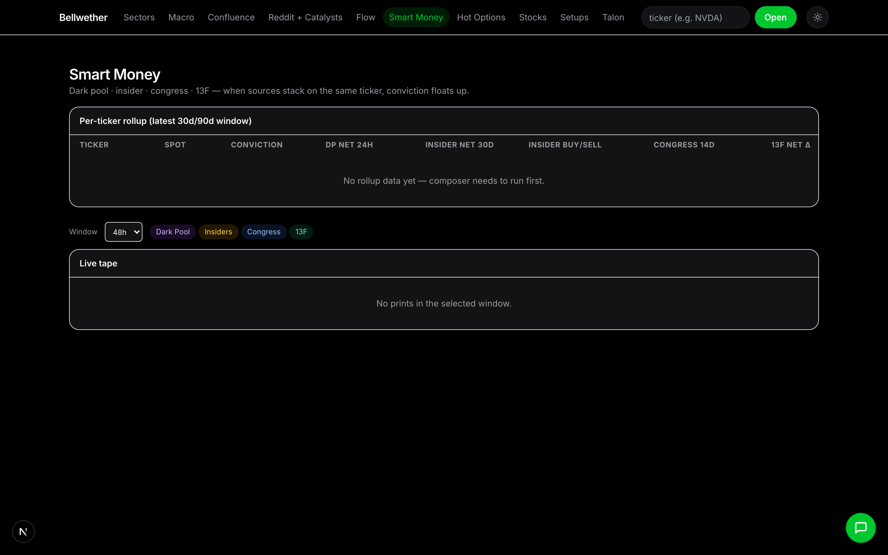

13F + insider Form 4 + dark-pool prints + ETF holdings rolled up per
ticker. Use to confirm whether the call-flow / GEX setup you see on
other tabs has institutional buying behind it, or is purely retail.

### Delphi — multi-source ensemble forecast

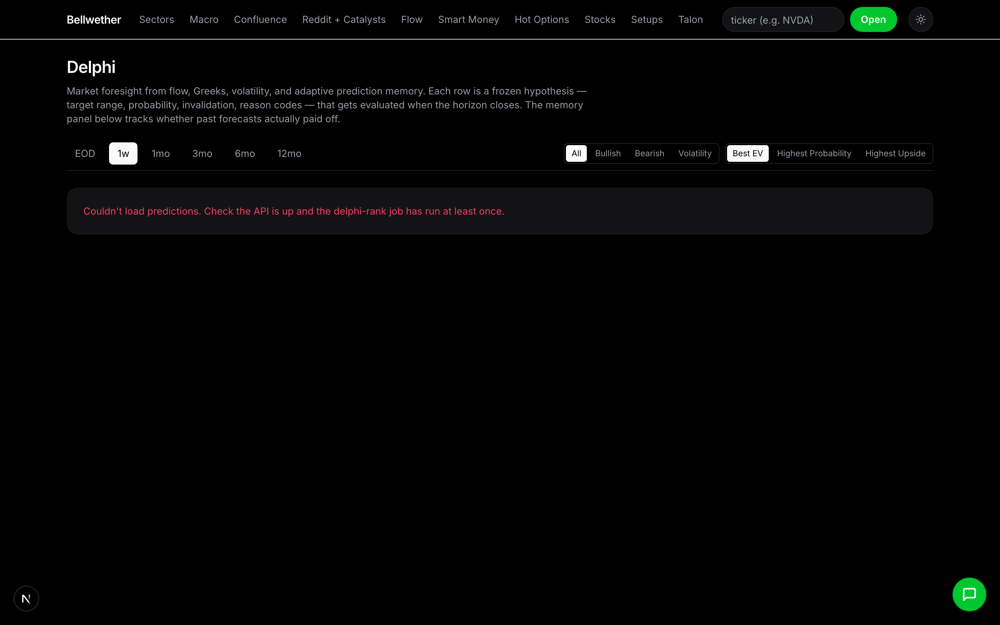

The 25-agent ensemble + the XGBoost predictor + sentiment composite
fused into one forecast per ticker. Shows the bull-case, bear-case,
and base-case panels with the underlying source signals.

### Conviction — per-ticker high-conviction setups

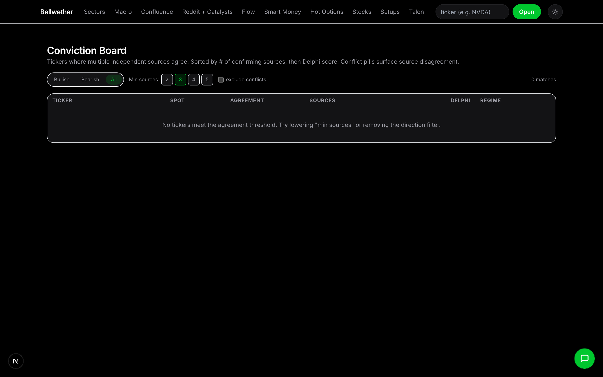

Filters the universe down to only tickers where multiple high-weight
gates align (delta-buildup top-decile, theme coherence ≥0.5, gamma
positive, etc.). Smaller daily list than the Screener/Scanner — designed
for "if I could only trade 5 things this week".

### Earnings — calendar + reaction tracker

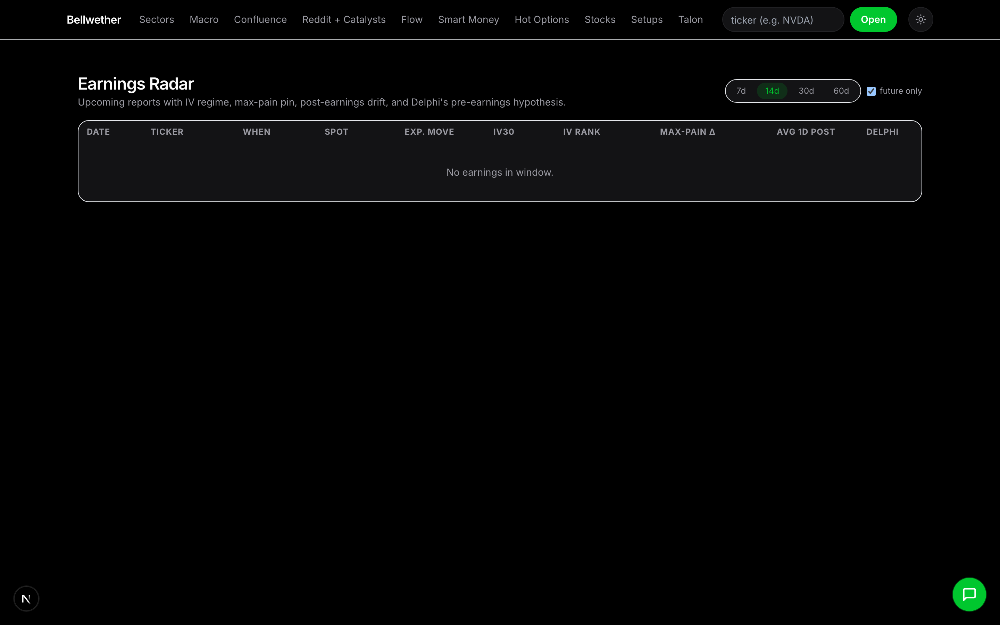

Upcoming earnings ordered by report date, with implied-move %, gamma
exposure context, and post-earnings reaction history. Distinguishes
pre-market / after-market times.

### Backtest Lab — strategy backtester

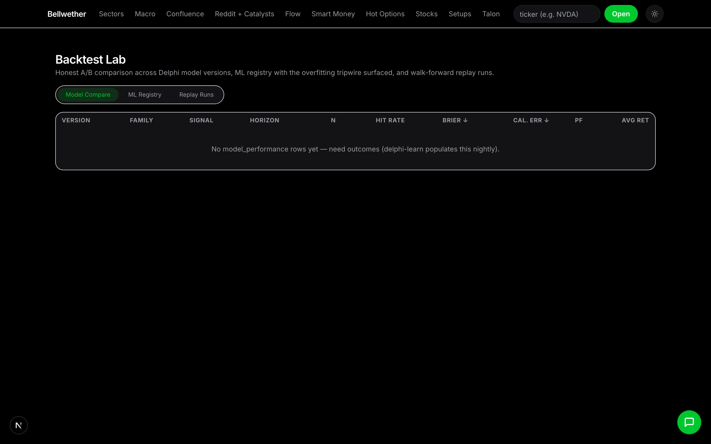

Hosted version of the v5 backtester (S&P 100 OOS — CAGR 27 %, Sharpe
1.28). Tune entries/exits, rerun, see per-ticker equity curves +
parameter-sensitivity. Pairs with `apps/backtester/FINAL_STRATEGY_v5.pine`
for TV-side validation.

### Heatseeker — intraday GEX monitor (SPY / QQQ / SPXW)

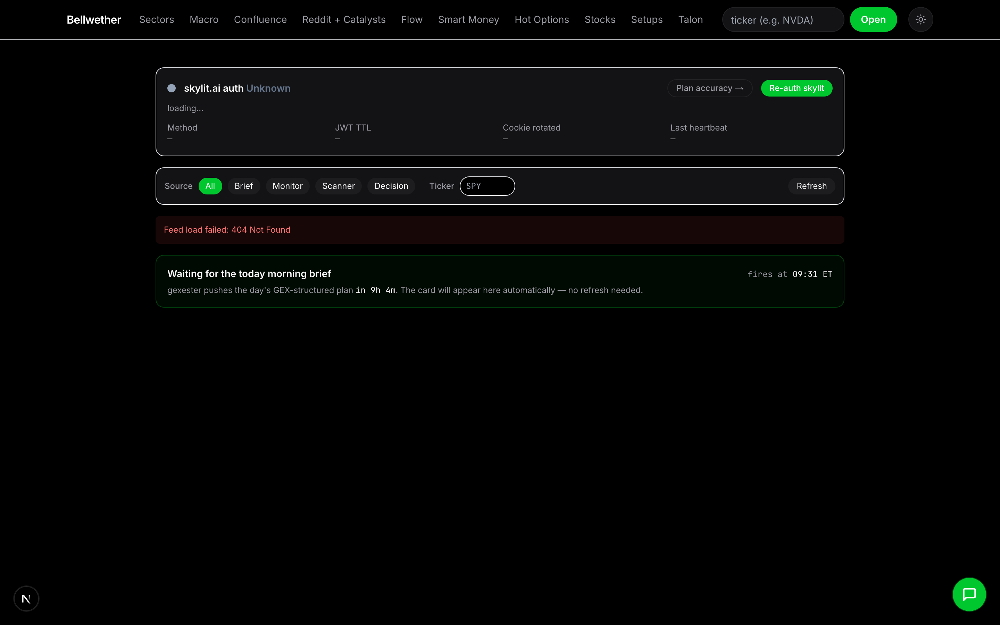

Morning brief + intraday level alerts for the index/ETF complex. Was
the "GEX" tab; renamed Heatseeker May 22 (path unchanged). Powered by
the `apps/gex` service.

### Lab — opportunity score, calibration, ensemble freshness


A secret `/lab` tab (not in the top nav, link is in the dock) collects
the tooling we use to keep the ensemble honest:

- **Opportunity score (0–100)** per ticker — `/v1/stocks/{T}/opportunity`
  combines XGB sector edge, flow conviction, persona consensus, and
  catalyst freshness into one number.
- **Calibration line** — predicted opportunity score vs. realized 5d
  forward return, bucketed, so you can eyeball whether the score is
  paying off.
- **Screener freshness panel** — last-run timestamp + the catalyst
  rerun queue (`cfp-jobs rerun-stale` triggers an ensemble refresh on
  any ticker that picked up a fresh, high-confidence Reddit catalyst).
- **Replay** — `/v1/agents/{T}/replay` returns the exact persona
  signals + debate transcript from any prior run for diffing.

The **morning brief** (`cfp-jobs morning-brief`) is the cron-fed
narrative version of all of the above: today's top opportunity scores,
fresh catalysts, flow standouts, and any GEX regime shifts, dropped
into the daily refresh log so you have one page to skim at the open.

### GEX — morning brief + intraday level alerts (SPY / QQQ / SPXW)

The GEX tab surfaces structural reads from the **skylit.ai / Heatseeker
0DTE GEX data** for the index trio. The morning brief auto-fires at
**09:31 ET** on NYSE trading days with king nodes, pika floors and
ceilings, barney walls, regime score, bias, and active patterns per
ticker. Intraday checkpoints (10:00, 10:30, …, 15:55 ET) emit a card
**only when something material changed since the last baseline** —
regime crossing ±0.30, king sign flip, spot breaking a baseline floor or
ceiling, trinity alignment shift, or a new pattern detected. Filter by
source (Brief / Monitor / Scanner) or by ticker.

A live skylit auth status badge (green / yellow / red) sits at the top
of the page along with a **Re-auth skylit** button — clicking it queues
a job for the local `cfp-jobs skylit-watch` daemon, which opens a
Chromium window for Discord OAuth and writes the captured Clerk cookie
back into Postgres so the next deploy survives without manual re-auth.
With the in-process rotation persistence fix, you only need to re-auth
when Clerk genuinely expires the underlying session (roughly once a
quarter, not every other day).

The poller, scheduler, brief, and monitor all live in `apps/gex/` and
deploy as a second Railway service alongside the API, reading cookies
from Postgres (`skylit_credentials`) on boot. See
[apps/gex/railway.toml](apps/gex/railway.toml) for service setup notes
and the bootstrap CLI (`cfp-jobs skylit-bootstrap`) for the one-time
migration of cookies from a local `.env`.

### Top-level assistant

A floating chat dock is mounted on every page. SSE-streamed Moonshot
tool-calling loop with six tools (`get_rankings`, `get_sectors_heatmap`,
`get_agents_for_ticker`, `get_catalysts`, `run_ensemble`, `navigate`) so
you can ask "what's flagged in tech today?" or "run the ensemble on
RKLB" from anywhere. The dock is **page-aware**: it pre-loads the
current route's context (active sector, ticker, filters) so questions
like "explain this ranking" or "why is this one flagged?" resolve
against what you're looking at.

---

## Architecture

```
apps/
  api/              # FastAPI inference + chat service (Railway)
  jobs/             # Ingestion, ensemble runner, screener/scanner/explosive refresh, skylit-watch daemon
  web/              # Next.js 15 + React 19 + Tailwind + lightweight-charts (Vercel)
  gex/              # Node.js Heatseeker SSE poller + 09:31 ET scheduler + intraday monitor (Railway, separate service)
  discord_listener/ # Allow-listed Discord channel ingest (Railway, separate service)
packages/
  shared/     # Pydantic schemas
  features/   # Feature engineering (Alpha158, Granger, sector flows)
  models/     # XGBoost training + inference
  agents/     # 25-agent ensemble (LangGraph state machine)
  skills/     # Claude skill bundles
local-chat/   # Standalone `lc` CLI — UW-only positioning pipeline, Claude Code companion
infra/
  migrations/ # SQL migrations (0001..0032)
  railway.toml      # API service config
                    # Note: apps/gex and apps/discord_listener each have their own railway.toml — three services in the same project
docs/
  DESIGN.md
  screenshots/
```

**Data layer:** Postgres + TimescaleDB (`prices_daily`, `macro_daily`,
`features_daily`, `lead_lag_matrix`, `sector_holdings`,
`fundamentals`, `agent_signals`, `watchlists`, `uw_*` for Unusual
Whales, `uw_etf_holdings`, `uw_catalysts`, `uw_spot_gex_1m`,
`uw_institutional_flow`, `reddit_mentions`, `reddit_posts`,
`reddit_predictions`, `reddit_outcomes`, `news_items`,
`etf_breadth_snapshots`, `whale_conviction`, `run_evidence`,
`agent_eval`, `stock_universe`, `scanner_results`, `explosive_board`,
`discord_messages`).

**Agent ensemble:** LangGraph DAG —
`analysts → personas → debate → researchers → trader → risk_manager → portfolio_manager`.
Provider-agnostic (Anthropic or Moonshot), with Langfuse cost tracking.

---

## Local dev

### Prereqs

- [uv](https://docs.astral.sh/uv/) — Python toolchain
- [pnpm](https://pnpm.io/) 9.x — JS workspaces
- Docker — local Postgres + TimescaleDB

### Bring it up

```bash
# 1. Postgres + TimescaleDB (auto-applies infra/migrations/*.sql on first run)
make up

# 2. Install Python workspace
uv sync --all-packages --all-extras

# 3. Install JS workspace
pnpm install

# 4. Apply any new migrations against an existing DB (idempotent)
make migrate

# 5. Run the API
cp .env.example .env
make dev   # http://localhost:8000

# 6. Run the web app (in a second terminal)
cd apps/web && pnpm dev   # http://localhost:3000

# 7. Smoke tests
curl http://localhost:8000/health        # {"status":"ok"}
curl http://localhost:8000/healthz/db    # {"status":"ok"} when DB is up
```

### Data ingestion

```bash
make backfill   # 5y yfinance OHLCV (~50 symbols) + FRED macro (~8 series)
make daily      # 7-day incremental, idempotent — schedule on cron
make status     # row counts + freshness per table
```

Requires `FRED_API_KEY` in `.env`. yfinance is unauthenticated. Optional
data sources (set in `.env` to enable):

- `FMP_API_KEY` — fundamentals + ETF holdings
- `UNUSUAL_WHALES_API_KEY` — options flow, dark pool, insider
- `LANGFUSE_*` — prompt + cost tracing
- `MOONSHOT_API_KEY` or `ANTHROPIC_API_KEY` — agent ensemble

### Running the ensemble for a ticker

```bash
uv run --package cfp-jobs cfp-jobs run-agents NVDA
uv run --package cfp-jobs cfp-jobs build-watchlist
```

### `lc` — local-chat options pipeline (Claude Code companion)

`lc` is a **separate pipeline** from the web app: a self-contained CLI
in `local-chat/` that pulls Unusual Whales data, computes positioning
metrics in Python, and (optionally) hands the finished numbers to an
LLM. Nothing in it depends on the Bellwether database, the FastAPI
service, or the Next.js dashboard — you can run it in any repo
checkout against just `UNUSUAL_WHALES_API_KEY`. LLM keys are only
required for `lc analyze` without `--no-llm`.

It's specifically designed to **pair with Claude Code**: every command
prints structured markdown to stdout (or `--json` for machine
ingestion), so you can run it inside a Claude Code conversation and
the model can read the output directly without any tool plumbing.
The intended workflow is:

> *"Run `uv run lc analyze IREN --no-llm` and tell me whether the Jan
> 2028 calls look like real positioning or sold premium."*

Claude Code executes the command via its shell tool, reads the
deterministic numbers, and reasons from there — the LLM never touches
the raw UW chain, only the pre-computed `PositioningInput`.

```bash
# Install once
uv sync --package local-chat

# Full positioning read (flow + GEX + OI), LLM-interpreted
uv run --package local-chat lc analyze IREN

# Just dump computed inputs — feed this to Claude Code as evidence
uv run --package local-chat lc analyze IREN --no-llm
uv run --package local-chat lc analyze IREN --no-llm --json > /tmp/iren.json

# Single-concern views (no LLM, Claude-Code-friendly)
uv run --package local-chat lc flow  IREN          # net call/put $, sweeps, top contracts
uv run --package local-chat lc gex   IREN          # dealer gamma, regime, flip level, walls
uv run --package local-chat lc oi    IREN          # largest strikes, fastest growth
uv run --package local-chat lc info  IREN          # everything UW has, markdown

# Verify a specific contract (opening longs vs sold-to-open?)
uv run --package local-chat lc verify IREN 110 call 2028-01-21
```

The built-in rollups bucket expiries into weekly / front_month / leap.
For an expiry-specific slice (e.g. "just the Jan 2028 calls") pull the
`--no-llm --json` dump and filter in Python — the assembled
`PositioningInput` carries the full per-contract chain.

**Prompt patterns that work well inside Claude Code:**

| Ask | What Claude Code runs |
|-----|-----------------------|
| *"Give me the positioning read on IREN."* | `lc analyze IREN --no-llm` |
| *"Is the IREN $110 call Jan-28 real positioning or sold premium?"* | `lc verify IREN 110 call 2028-01-21` |
| *"Where's the GEX flip on SPY and what walls matter today?"* | `lc gex SPY` |
| *"What strikes are growing fastest on PLTR over the last 30 days?"* | `lc oi PLTR --lookback 30` |
| *"Compare flow on SOFI vs HOOD."* | Two `lc flow` calls + reasoning |
| *"Dump everything UW has on RKLB into a file I can grep."* | `lc info RKLB --json > rklb.json` |

### Skylit (Heatseeker) login refresh

skylit.ai sits behind Clerk + Discord OAuth. Discord blocks programmatic
login (captcha + ToS), so a human consent click in a real Chromium
window is unavoidable. With the gex service deployed on Railway,
cookies now live in Postgres (`skylit_credentials`); the laptop's only
role is to capture fresh cookies when needed, which the
**rotation-persistence fix** makes a roughly quarterly event rather
than daily.

Two workflows depending on whether you're seeding for the first time or
refreshing later:

**One-time bootstrap** — if you already have valid CLERK_* values in a
local `.env` (e.g. you ran the standalone gexester-vexster before),
seed Postgres without re-doing OAuth:

```bash
BELLWETHER_API_URL=https://capital-flow-predictor-production.up.railway.app \
BELLWETHER_API_KEY=<your key> \
uv run cfp-jobs skylit-bootstrap
```

**Ongoing re-auth** — leave this daemon running on your laptop; it
long-polls Bellwether for re-auth requests, opens Chromium for Discord
OAuth on demand (click the **Re-auth skylit** button in the GEX tab),
and writes the captured cookies back to Postgres automatically.

```bash
uv run playwright install chromium
caffeinate -i env \
  BELLWETHER_API_URL=https://capital-flow-predictor-production.up.railway.app \
  BELLWETHER_API_KEY=<your key> \
  uv run cfp-jobs skylit-watch
```

`cfp-jobs skylit-login` (the original one-shot CLI that writes to `.env`)
still works for fully-local dev where Postgres isn't in play.

### Capturing fresh README screenshots

```bash
# With API on :8000 and web on :3000
uv run python scripts/capture_screenshots.py
```

Writes **~21 PNGs** into `docs/screenshots/` — one per top-level nav tab
(Sectors, Macro, Confluence, Reddit + Catalysts, Flow, Smart Money, Hot
Options, Stocks, Setups, Talon, Delphi, Conviction, Earnings, Backtest Lab,
Discord Alerts, Heatseeker) plus the Sectors → Network sub-view, the Agents
drill-in, and the secret Lab tab. Numbering preserves backward compatibility
with older snapshots — `01-12` are the original tabs, `13` is Talon, `14-21`
fill in the tabs that weren't captured in the original script.

---

## Tests + CI

```bash
make test
```

CI runs the same commands plus a Postgres service container — see
[.github/workflows/ci.yml](.github/workflows/ci.yml).

---

## Daily refresh

```cron
30 22 * * 1-5  cd /path/to/repo && /usr/bin/make daily >> /tmp/cfp-daily.log 2>&1
```

(5:30pm ET on weekdays = 22:30 UTC.)

---

## Deploy

API: Railway, Dockerfile-based — [infra/railway.toml](infra/railway.toml).
Web: Vercel — [apps/web/vercel.json](apps/web/vercel.json).

**Required env vars** (full list with sensible defaults: [.env.example](.env.example)):

| Env | Where | Value |
|-----|-------|-------|
| `DATABASE_URL` | Railway | Auto-injected by Postgres add-on |
| `API_KEYS_RAW` | Railway | `openssl rand -hex 32` — leave empty to disable auth (dev only) |
| `CORS_ORIGINS_RAW` | Railway | `https://<your-vercel-domain>` |
| `ANTHROPIC_API_KEY` | Railway | Required for the **Deep Analysis** Claude path |
| `MOONSHOT_API_KEY` | Railway | Default LLM for the ensemble |
| `UNUSUAL_WHALES_API_KEY` | Railway | Required for flow/dark-pool/insider context |
| `FRED_API_KEY`, `FMP_API_KEY` | Railway | Required for macro + fundamentals |
| `NEXT_PUBLIC_API_BASE_URL` | Vercel | `https://<your-railway-domain>` |
| `NEXT_PUBLIC_API_KEY` | Vercel | **Same value** as one of the `API_KEYS_RAW` entries |

Migrations are auto-applied at boot via the FastAPI lifespan hook
(`apps/api/src/cfp_api/migrations.py`) — no manual `make migrate` step needed
unless you're seeding into a brand-new DB.

**Post-deploy verification:**

```bash
API_BASE=https://<your-api> API_KEY=<your-key> ./scripts/smoke_test.sh
```

Should print `8 passed, 0 failed`. The same script runs on every push to `main`
via [.github/workflows/smoke.yml](.github/workflows/smoke.yml). See
[docs/RUNBOOK_VERIFY.md](docs/RUNBOOK_VERIFY.md) for deeper checks.

**Endpoints documented in [docs/API.md](docs/API.md)** (regenerate via
`python scripts/export_openapi.py` after route changes).

---

## License

Private.
